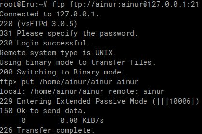

# Modul 1

## No.1
**SOAL:** Untuk mempersiapkan pembuatan entitas selain mereka, Eru yang berperan sebagai Router membuat dua Switch/Gateway . Dimana Switch 1 akan menuju ke dua Ainur yaitu Melkor dan Manwe. Sedangkan Switch 2 akan menuju ke dua Ainur lainnya yaitu Varda dan Ulmo. Keempat Ainur tersebut diberi perintah oleh Eru untuk menjadi Client.

**PENJELASAN:** Buat topologi LAN seperti gambar di bawah ini:


## No.2
**SOAL:** Karena menurut Eru pada saat itu Arda (Bumi) masih terisolasi dengan dunia luar, maka buat agar Eru dapat tersambung ke internet.

**PENJELASAN:**  Hubungkan node Eru dengan sebuah node NAT dan menuliskan konfigurasi untuk interface Eru yang terhubung. Interface yg dipilih adalah `eth0`.


Command yang dijalankan untuk mengatur configurasi..
```
echo "auto eth0" > /etc/network/interfaces
echo "iface eth0 inet dhcp" >> /etc/network/interfaces
```

## No.3
**SOAL:** Sekarang pastikan agar setiap Ainur (Client) dapat terhubung satu sama lain.

**PENJELASAN:**  Hubungkan tiap node Client dengan node Eru sebagai router mereka, lalu menuliskan konfigurasi untuk interface masing-masing (Eru dan para client).


Contoh command yang dijalankan untuk mengatur configurasi pada node-node client..
```
echo "auto eth0" > /etc/network/interfaces
echo "iface eth0 inet static" >> /etc/network/interfaces
echo "	address 192.240.1.2" >> /etc/network/interfaces
echo "	netmask 255.255.255.0" >> /etc/network/interfaces
```

Contoh command yang dijalankan untuk mengatur configurasi pada node Eru..
```
echo "auto eth0" >> /etc/network/interfaces
echo "iface eth0 inet static" >> /etc/network/interfaces
echo "	address 192.240.1.1" >> /etc/network/interfaces
echo "	netmask 255.255.255.0" >> /etc/network/interfaces
```

## No.4
**SOAL:** Setelah berhasil terhubung, sekarang Eru ingin agar setiap Ainur (Client) dapat mandiri. Oleh karena itu pastikan agar setiap Client dapat tersambung ke internet

**PENJELASAN:**  Tambahkan konfigurasi pada interface masing-masing node client.

Command yang dijalankan untuk mengatur configurasi pada node Eru..
```
echo "	gateway 192.240.1.1" >> /etc/network/interfaces
echo "	up echo nameserver 192.168.122.1 > /etc/resolv.conf" >> /etc/network/interfaces
echo "apt update -y && apt install iptables vim -y" >> /root/.bashrc
echo "iptables -t nat -A POSTROUTING -o eth0 -j MASQUERADE -s 192.240.0.0/16" >> /root/.bashrc
```

## No.5
**SOAL:** Ainur terkuat Melkor tetap berusaha untuk menanamkan kejahatan ke dalam Arda (Bumi). Sebelum terjadi kerusakan, Eru dan para Ainur lainnya meminta agar semua konfigurasi tidak hilang saat semua node di restart

**PENJELASAN:**  Tempatkan semua script pada directory `/root` dan selalu gunakan direct path dalam input command apapun (terutama text editor). Maka perubahan akan menetap setelah restart. Jika ingin script dijalankan ketika mesin baru mulai, tuils yang diinginkan pada `/root/.bashrc`.

## No.6
**SOAL:** Setelah semua Ainur terhubung ke internet, Melkor mencoba menyusup ke dalam komunikasi antara Manwe dan Eru. Jalankan file berikut [(link _file_)](https://drive.google.com/drive/folders/1ULr_Fik1O0_79zUng41POMZtdzJTugVR) lalu lakukan packet sniffing menggunakan Wireshark pada koneksi antara Manwe dan Eru, lalu terapkan display filter untuk menampilkan semua paket yang berasal dari atau menuju ke IP Address Manwe. Simpan hasil capture tersebut sebagai bukti.

**PENJELASAN:**  Download file pada salah satu mesin (Manwe atau Eru), decompress file zip yang telah didownload, lalu jalankan scriptnya. Untuk melihat lalu-lintas jaringan sebuah target, kita perlu berada di jalur lintas datanya. Jadi wireshark paling effectif dijalankan oleh Host controller GNS3 pada interface yang mewakili sebagai gateway dari network GNS (`virbr0`).


_[IP addr dari interface host controller]_


_[IP addr dari interface node Eru]_

Commmand yang dijalankan oleh Manwe dan/atau Eru..
```
apt update -y && apt install ca-certificates -y
wget "https://drive.google.com/uc?export=download&id=1bE3kF1Nclw0VyKq4bL2VtOOt53IC7lG5" -O /root/traffic.zip
apt install unzip && unzip /root/traffic.zip -d /root && chmod +x /root/traffic.sh
/root/traffic.sh
```

Wireshark hanya menunjukkan sambungan dari host controller `192.168.122.126` ke IP `8.8.8.8` atau `90.130.70.73`. Jadi hanya gateway atau NAT device yang terlihat.


_[Contoh hasil wireshark di host controller]_

## No.7
**SOAL:** Untuk meningkatkan keamanan, Eru memutuskan untuk membuat sebuah FTP Server di node miliknya. Lakukan konfigurasi FTP Server pada node Eru. Buat dua user baru: ainur dengan hak akses write&read dan melkor tanpa hak akses sama sekali ke
direktori shared. Buktikan hasil tersebut dengan membuat file teks sederhana kemudian akses file tersebut menggunakan kedua user.

**PENJELASAN:** Gunakan program FTP server yang bekerja dengan baik dengan CLI dan Linux. Disarankan program `vsftpd` dengan konfigurasi berikut pada `/etc/vsftpd.conf`:

```
listen=YES            # acts as a daemon and listens for connection requests
anonymous_enable=NO   # needs to login as one of server's user
local_enable=YES      # enable to login as one of user from server
local_umask=077       # default file permission for files inside shared directory (no permission for groups and others)
dirmessage_enable=YES # welcome message n stuff
ssl_enable=NO         # encrypted connection
pasv_enable=Yes       # server doesnt try to connect to client on random ports
pasv_min_port=10000   #   but instead opens itself on certain ports/portrange 
pasv_max_port=10100
local_root=/var/share/ftp  # shared directory location
write_enable=YES           # FTP user allowed to put its files to shared directory
```

Command yang dijalankan: 

```
mkdir -p /var/share/ftp
chown :ftp /var/share/ftp
chmod g+w /var/share/ftp

useradd -aG ftp -m ainur 
echo ainur | passwd ainur --stdin
useradd -m melkor  # without home dir, login ftp will fail
echo melkor | passwd melkor --stdin
```




_[Perbandingan kemampuan dua user dengan permission yang berbeda]_

## No.8
**SOAL** Ulmo, sebagai penjaga perairan, perlu mengirimkan data ramalan cuaca ke node Eru. Lakukan koneksi sebagai client dari node Ulmo ke FTP Server Eru menggunakan user ainur. Upload sebuah file berikut (link file). Analisis proses ini menggunakan Wireshark dan identifikasi perintah FTP yang digunakan untuk proses upload.

**PENJELASAN:** Lihat wireshark pada interface `lo` untuk menguping komunikasi telnet antara host controller (port 5000) dengan terminalnya host sendiri.


_[Terlihat command yang dipakai itu `put`]_

Pengiriman file ke node Eru menggunakan telnet juga, dengan copas lalu print ke file dalam node Eru.

## No.9
**SOAL** Eru ingin membagikan "Kitab Penciptaan" di (link file) kepada Manwe. Dari FTP Server Eru, download file tersebut ke node Manwe. Karena Eru merasa Kitab tersebut sangat penting maka ia mengubah akses user ainur menjadi read-only. Gunakan Wireshark untuk memonitor koneksi, identifikasi perintah FTP yang digunakan, dan uji akses user
ainur.

**PENJELASAN** Ubah konfigurasi permission pada `/etc/vsftpd.conf`.

```
local_umask=0377  # any file in shared dir can only be read
write_enable=NO   # cant upload files
```


_[Mulai data transfer]_


_[Pengiriman data / kitab]_


_[Perintah yang digunakan untuk mendownload kitab adalah `get`]_


_[Percobaan mengupload clone kitab tidak berhasil]_

## No.10
**SOAL** Melkor yang marah karena tidak diberi akses, mencoba melakukan serangan dengan mengirimkan banyak sekali request ke server Eru. Gunakan command ping dari node Melkor ke node Eru dengan jumlah paket yang tidak biasa (spam ping misalnya 100 paket). Amati hasilnya, apakah ada packet loss? Catat average round trip time untuk melihat apakah serangan tersebut mempengaruhi kinerja Eru.

**PENJELASAN** Melkor mencoba untuk melakukan ping sebanyak 10.000 kali dengan interval antar ping sebesar 2 ms. Namun tidak membuahkan hasil yang diinginkan karena rtt yang dihasilkan tidak berubah besar dibanding dengan 5 paket dengan interval yang serupa.

Baru berdampak apabila dijalankan command `ping` secara parallel. Sejumlah 30 berlangsungan menghasilkan dampak penggunaan CPU 99% di server GNS3 dan rtt paling lama 2.7 detik.

```
root@Melkor:~# ping -4 -c 10000 192.240.1.1 -i 0.002 -q 
PING 192.240.1.1 (192.240.1.1) 56(84) bytes of data.

--- 192.240.1.1 ping statistics ---
10000 packets transmitted, 10000 received, 0% packet loss, time 19996ms
rtt min/avg/max/mdev = 0.025/0.264/0.680/0.116 ms
```

_[Ping 10000 kali dengan rata-rata rtt 0.264 ms]_

```
root@Melkor:~# ping -4 -c 5 192.240.1.1 -i 0.002 -q 
PING 192.240.1.1 (192.240.1.1) 56(84) bytes of data.

--- 192.240.1.1 ping statistics ---
5 packets transmitted, 5 received, 0% packet loss, time 8ms
rtt min/avg/max/mdev = 0.225/0.387/0.532/0.118 ms
```

_[Ping 5 kali dengan rata-rata rtt 0.387 ms]_

```
--- 192.240.1.1 ping statistics ---
10000 packets transmitted, 10000 received, 0% packet loss, time 20049ms
rtt min/avg/max/mdev = 0.022/0.053/2.710/0.058 ms
```

_[Salah satu statistik ping setelah dijalankan secara parallel]_ 

---------

