# Modul 1

## No.11
**SOAL:** Sebelum era koneksi aman, Eru sering menyelinap masuk ke wilayah Melkor. Eru perlu masuk ke node tersebut untuk memeriksa konfigurasi, namun ia tahu Melkor mungkin sedang memantau jaringan. Buktikan kelemahan protokol Telnet dengan
membuat akun dan password baru di node Melkor kemudian menangkap sesi login Eru ke node Melkor menggunakan Wireshark. Tunjukkan bagaimana username dan password dapat terlihat sebagai plain text.

**PENJELASAN:** Dibuat prompt password sederhana pada `.bashrc` Melkor dengan isinya sebagai berikut:
```
while true; do 
  read -rp "Password: " PASS 
  [[ $PASS == "melkor" ]] && break
done
```

..lalu coba telnet dari Eru ke Melkor (192.168.122.1 port 5002) lalu awasi interface controller `virbr0` dg wireshark.

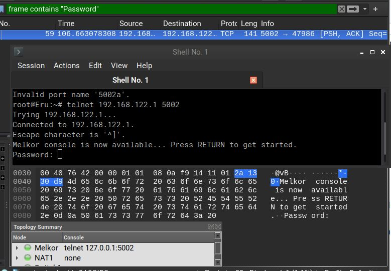

_[Melkor ada pada port 5002 dan terlihat prompt passwordnya]_

Yang terlihat ketika mengirimkan password adalah pengiriman per huruf seperti berikut (passwordnya "melkor"):

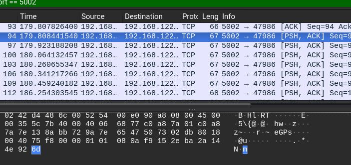
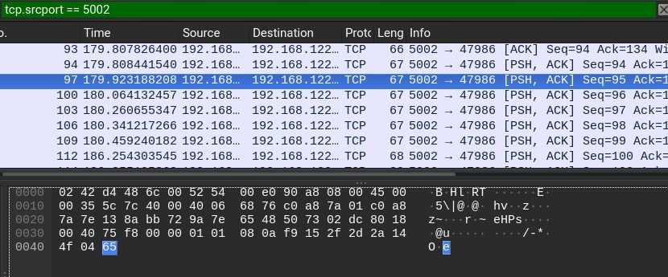
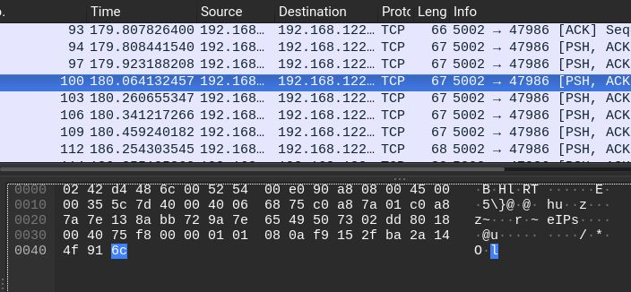
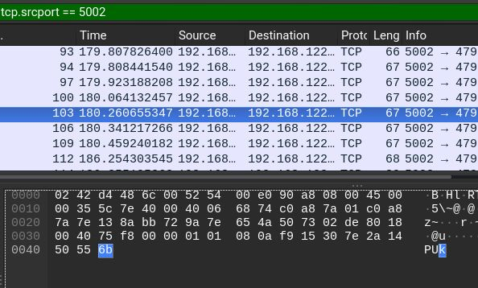
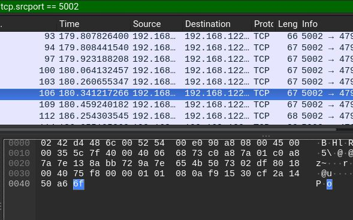
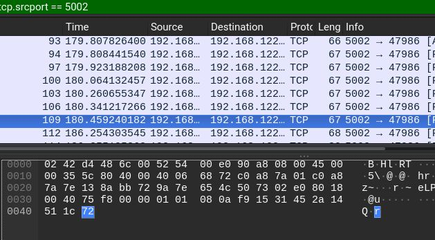
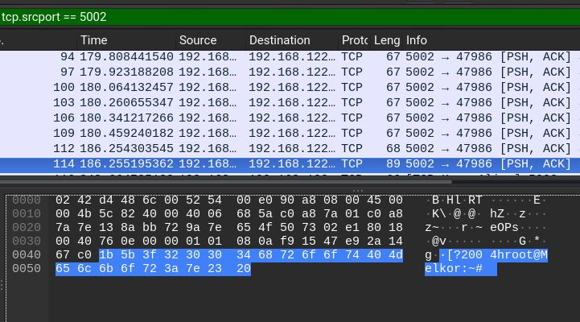

_[Gambar terakhir menunjukan Eru telah terhubung dalam node Melkor]_

## No.12
**SOAL:** Eru mencurigai Melkor menjalankan beberapa layanan terlarang di node-nya. Lakukan pemindaian port sederhana dari node Eru ke node Melkor menggunakan Netcat (nc) untuk memeriksa port 21, 80, dalam keadaan terbuka dan port rahasia 666 dalam
keadaan tertutup.

**PENJELASAN:** Scan port dengan menggunakan command berikut dari node Eru ke Melkor (192.240.1.2):
```
nc -zv 192.240.1.2 21
nc -zv 192.240.1.2 80
nc -zv 192.240.1.2 666 
```

Untuk menjalankan nc dalam mode listen, jalankan command berikut pada node melkor:
```
nc -l 80 > /root/p80.txt
```

Namun tampaknya Melkor tidak melakukan apapun yang mencurigakan..

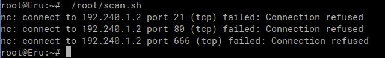


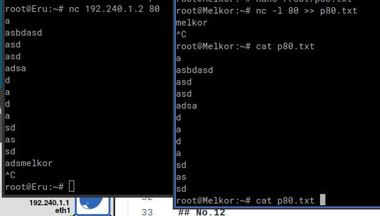

_[andaikan Melkor membuka server pada port 80 dan mencatat hasilnya pada sebuah file]_

## No.13
**SOAL:** Setelah insiden penyadapan Telnet, Eru memerintahkan semua koneksi administratif harus menggunakan SSH (Secure Shell) untuk mengamankan jaringan. Lakukan koneksi SSH dari node Varda ke Eru. Tangkap sesi tersebut menggunakan Wireshark. Analisis dan jelaskan mengapa username dan password tidak dapat dilihat seperti pada sesi Telnet. Tunjukkan paket-paket terenkripsi dalam hasil capture sebagai bukti keamanan SSH.

**PENJELASAN:** Install `openssh-server` lalu jalankan daemonnya dengan `service ssh start`. Akun sebelumnya dari soal FTP bisa digunakan kembali. Kalau analisis dilakukan dalam Eru, maka paket yang terlihat akan terenkripsi dengan jenis public encryption. Namun komunikasi antar controller dengan terminal host masih belum terenkripsi, jadi bisa dilihat passwordnya sama seperti soal nomor 11.

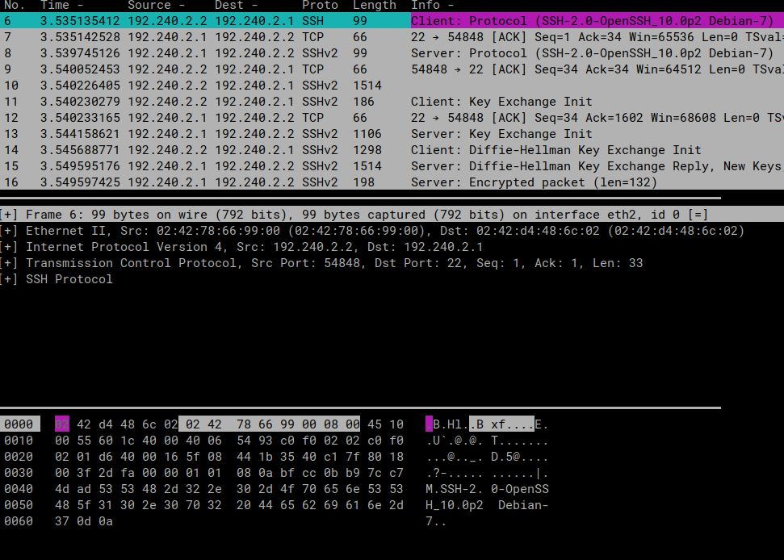
